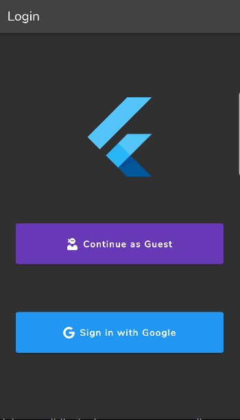
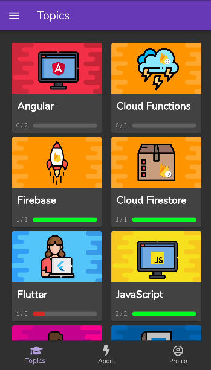
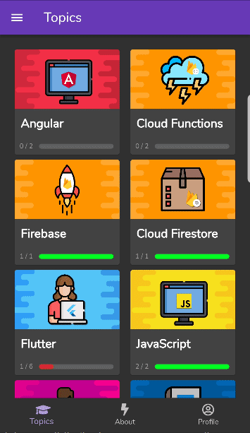

<h1 align="center">Quiz App</h1>

## 🏁Description

<div style="text-align: justify">Quiz App is a cross-platform mobile app, that allows you to test your knowledge on various technologies through quizzes. It's built with Flutter & Dart, and targets primarily Android and iOS.</div>

 



## ⛏️Built With

- [Dart](https://dart.dev/) - A client-optimized language for developing fast apps on any platform.
- [Flutter](https://flutter.dev/) - An open source framework by Google for building beautiful, natively compiled, multi-platform applications from a single codebase.
- [Firebase](https://firebase.google.com/) - A BaaS backed by Google


## ⛓️Prerequisites

- [Flutter SDK](https://docs.flutter.dev/get-started/install) v2.8.1 or higher
- [Android](https://developer.android.com/studio) or [iOS dev environment](https://developer.apple.com/xcode/)

## 🚀Run

#### Clone repository
```
git clone https://github.com/MisterRoy/quizapp.git
```

#### Install dependencies
```
flutter pub get
```
#### Launch
```
flutter run
```

## 👨🏾‍💻Authors
* [Mr. Roy](https://github.com/MisterRoy)


## 👋🏿Acknowledgments
I built this app thanks to Jeff's [awesome course](https://fireship.io/courses/flutter-firebase/).
You should definitely check out his [YouTube Channel](https://www.youtube.com/c/Fireship).

* [Jeff Delaney](https://github.com/codediodeio)
* Flutter Team at Google
* All authors of the differents pub packages used in this project
  
